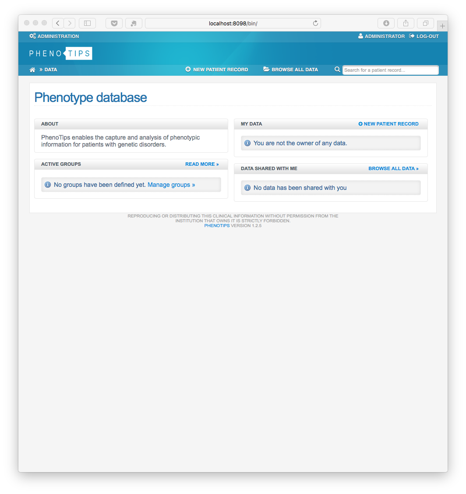
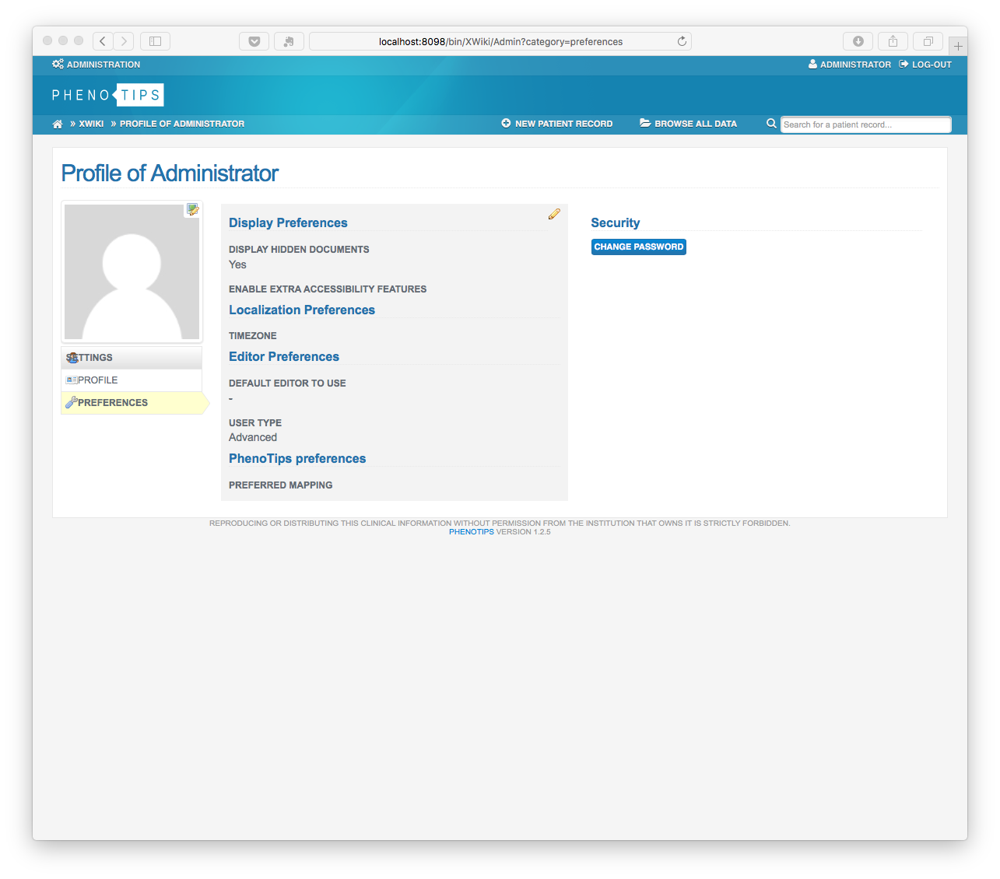
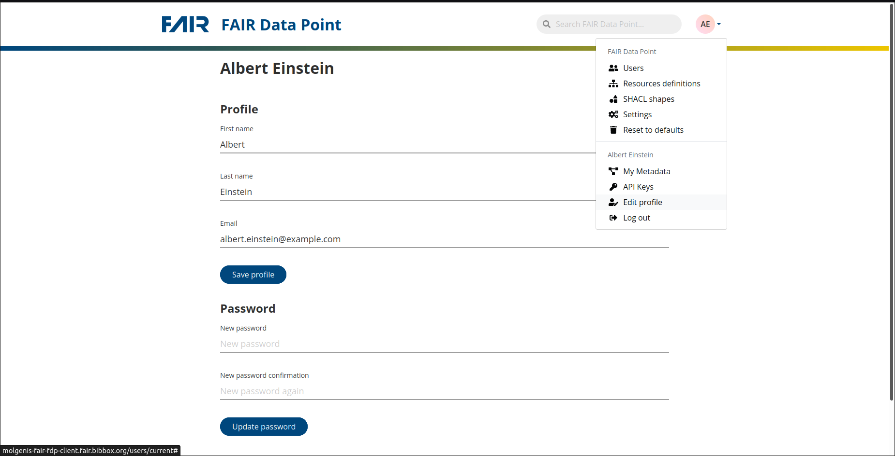

## APP-PHENOTIPS Installation Instructions 

### Intsallation with BIBBOX

Please fill all fields with appropriate data for the FDP

### Set Up

* Start the application
* Phenotips will first intitialize its database (can take some minutes)
* In the distrubution wizard click on **CONTINUE**

* Install the Phenotips Application interface by pressing **INSTALL** (this can take several minutes, up to a hour depending on your internet connectivity) 

* Press **CONTINUE**. Further Phenotips components are now downloaded, maybe you run in a timeout, dont worry just login and the download of the components will continue

* INITIAL-USER:   admin
* INITIAL-PASWORD admin

* Press **CONTINUE** in some screens and you should arive at

* Change the admin password and continue with your configuration, as described at https://phenotips.org/AdminGuide/UserAdministration

#### Set up FAIR Data Point.

Open Jupyter via the app dashboard or by chnagung the subdomain of the url to `<instancename>-juypter`:

Execute jupyter notebook (/work/fillFDP.ipynb) by clicking the fast forward symbol (&#9193;) on the top to:

1. set up FDP using environment variables set in `docker-compose.yml` / `docker-compose.yml.template` 
    
2. set User credentials (Mail: `albert.einstein@example.com`, Password: `password`)\
PLEASE CHANGE DEFAULT PASSWORD!

#### Change default password

Open teh FDP-client via the app dashboard or by changing the subdomain of the url to `<instancename>-fdp-client`.

Default username is "albert.einstein@example.com" and password is set to "password".
Log in at FAIR Data Point and change the password (top right corner: "edit profile")

## After the installation

Have a nice ride with the new Admins youngtimer.

